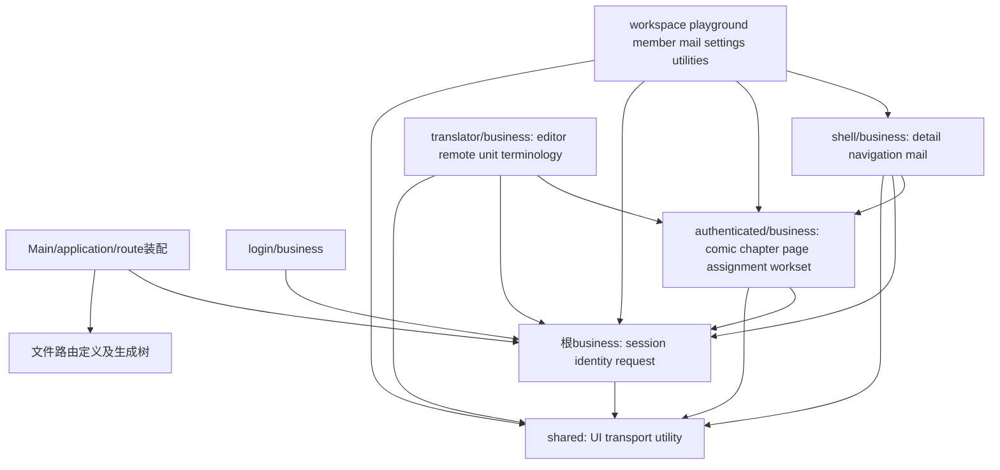
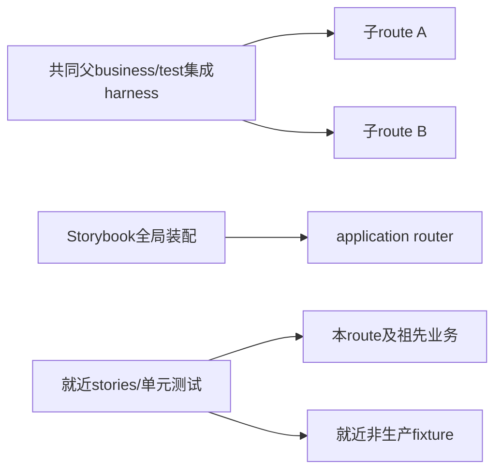

# 依赖迁移图与库存使用说明

依据：S02/S03；CSV基线480个已跟踪文件（不包括本轮新文档）。所有权目录与请求运行生命周期必须分别阅读。

## 1. 现状中的跨归属依赖

| 真实源码 | 当前依赖 | 目标处理 |
| --- | --- | --- |
| `src/features/Workspace/components/business/Workspace.tsx` | ComicPlayground的详情与章节/漫画请求 | 共同详情提升shell；跨shell/translator契约提升authenticated |
| `src/features/WebTranslator/components/business/WebTranslator.tsx` | BaseTranslator和ComicPlayground术语请求 | 完整移入translator，不再横跨两个feature树 |
| `src/types/raw/unit.ts` | BaseTranslator的diff/search类型 | 单元值、raw转换、保存契约一起归translator |
| `src/types/comic.ts` / `raw/comic.ts` | workset、chapter、assignment、identity | 共享漫画契约引用authenticated同层概念及根identity；不能引用playground CRUD/input |
| `src/features/ComcList/components/business/ComicList.tsx` | ComicProgressList、FilterHeader、WorksetSidebar | 独占列表整体归playground；只把真正共同呈现留shell |
| `src/api/util.ts` | app store和NotificationToast | shared纯传输接受注入；根request装配会话与业务错误 |
| `src/store/app.ts` | session和sysMail两种状态 | 根session维持persist；shell mail独立且绑定身份 |
| `src/App.tsx` | useTeamOnlineLease | 根身份范围的长期租约，不能随shell卸载停止 |
| `src/features/Settings/SettingsPanel.tsx` | pageUploadStore取消上传 | 依赖shell祖先的上传module，上传runtime自行观察根session失效 |
| `scripts/test-*-browser.mjs` / 压缩Worker | 字符串形式源码入口 | 切换到新入口，运行浏览器与生产构建验证；仅AST import检查不足 |

## 2. 目标生产依赖

箭头表示“可依赖”，并不要求每个module全部引用。根不能import shell上传；上传runtime订阅session，实现失效取消。共同父内部概念可以互引类型，避免通过全局barrel隐藏关系。纯数据声明不再import raw转换器：comic/chapter/team/workset的to转换移至对应raw adapter，CSV逐项记录split/merge。既有comic/chapter嵌套转换保留数据深度语义并以fixture验证，不能将类型循环误当作请求循环。

## 3. 测试装配依赖例外

例外限定验证文件和已登记测试目录，不豁免整个父业务。生产不得反向依赖测试/fixture。原API migration大测试分为identity/comic/chapter/page/unit契约测试，各自就近；真实跨route集成测试放共同父测试目录。

## 4. file-map.csv 格式与实施规则

- 一行对应一个基线已跟踪source，当前480行全部唯一。
- `target`：最终文件路径；`split`使用分号列多个准确目标；空值仅用于delete。多个source合并同target是允许的，但必须按职责合并，不能后写覆盖。
- `action`：retain原样保留、update原位置修改、move迁移并修正代码、split拆分职责、merge合并到唯一目标、delete删除且更新全部引用。
- `owner`：主负责目标module；split的其他目的地以target列为准，不表示它们的永久所有权均归owner。
- `plan`：唯一主实施工作包，其他工作包通过依赖等待，不共同修改同一source。S01负责依赖初始切换；P003及P009等后续可按自己的明确步骤再修改配置。
- `spec`：适用规范族，具体条款通过计划引用；S02对所有行有效。
- `reason`：迁移/拆分的职责理由；21个当前超限文件均有明确split和目的地。
- `verification`：该条目的最低验证，不能替代工作包完整验收。

CSV保留repo外观资源、第三方skill说明、许可证和swagger位置；活动工程文档、CI、配置与script命令需更新。`src/stories/Configure.mdx`与无引用教学资源删除；AVIF测试素材保留。AssignmentCard/List的stories各自在文件内定义演示实现，没有引用生产module，删除这两项脚手架演示；生产分工展示仍由详情/工作台stories覆盖，真实交互stories全部保留并就近迁移。

无旧source的新文件与提前抽取的新职责在 [new-files.csv](new-files.csv) 登记目标、主工作包和验收；不伪造旧source加入480项CSV。每份plan附表从两份清单展开。实现中若基线后新文件出现，先补库存与负责人，再开展该文件迁移。

## 5. 工作包依赖与写入协调

| 工作包 | 主要拥有范围 | 不可并行覆盖的共同位置 |
| --- | --- | --- |
| P001 | 依赖、TS/ESLint/Vite任务基础 | deno/package/lock/tsconfig，由P001先写 |
| P002 | shared、根session/identity/request | app-store分割与根类型迁移先于叶子 |
| P003 | router、route入口、shell装配与导航 | 生成树只通过generate；不手工多人编辑 |
| P004 | authenticated契约、shell详情/上传/共同列表 | 多入口共享定义一次迁移，叶子只更新调用 |
| P005 | workspace与playground | 不再次实现P004共同动作 |
| P006 | member/system-mail/settings | mail请求/cache归shell，叶子只装配界面 |
| P007 | utilities与压缩浏览器脚本入口 | shared压缩由P002拥有，不另复制 |
| P008 | translator全业务 | 保持Web diff协议，不替换Native持久化模型 |
| P009 | 全部stories、fixture和验证装配 | 不与对应业务文件迁移同时改stories引用 |
| P010 | 全仓规范与主题落实 | 业务迁移阶段先执行规范；最终统一审查避免二次大搬迁 |
| P011 | 门禁、CI、script及文档 | 检查旧路径时为本迁移历史清单留明确豁免 |
| P012 | 全链回归与清零验证 | 不将未运行检查标通过 |

可并行的实际顺序由plan/README的DAG统一决定；此表描述所有权，不另规定冲突的实施次序。对所有目标检查重复路径：只有显式merge/split共同目的地可重复；非合并重名属于清单错误，必须先修正文档。
