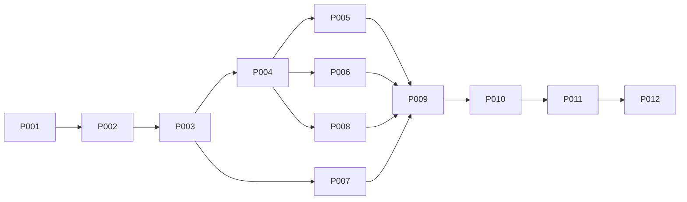

# 实施 plans 索引

状态：P001–P009 主体代码已落地且本机自动门禁通过；P010–P012 的逐组件完整人工审查及跨平台验收仍未全部完成。
自动检查结果与实际验证边界见 [实施报告](../review/implementation-results.md)。
目录、路由和业务主体已迁移，不能将代码落地等同于工作包验收完成。
ready表示设计具备执行步骤，不代表当前就可开始；实时任务、文件锁和证据见[调度记录](execution.md)。

## 依赖图

## 工作包

| ID | 工作包 | 前置 | 设计状态 | 实施状态 |
| --- | --- | --- | --- | --- |
| P001 | [固定 Native 工具链并建立迁移诊断基线](P001-toolchain.md) | none | ready | implemented / local-check-passed |
| P002 | [建立 shared 基础与根会话业务](P002-shared-and-session.md) | P001 | ready | implemented / local-check-passed |
| P003 | [切换 TanStack 文件路由与 shell 装配](P003-file-routing.md) | P002 | ready | implemented / local-check-passed |
| P004 | [迁移跨 route 契约与漫画详情业务](P004-shared-business.md) | P003 | ready | implemented / local-check-passed |
| P005 | [迁移工作区与漫画广场全部私有业务](P005-workspace-and-comic.md) | P004 | ready | implemented / local-check-passed |
| P006 | [迁移成员、信箱与设置全部业务](P006-member-mail-settings.md) | P004 | ready | implemented / local-check-passed |
| P007 | [迁移实用工具与浏览器 Worker 入口](P007-utilities.md) | P003 | ready | implemented / local-check-passed |
| P008 | [迁移完整翻校业务与编辑生命周期](P008-translator.md) | P004 | ready | implemented / local-check-passed |
| P009 | [收拢就近测试与 Storybook 全套运行环境](P009-storybook-and-testing.md) | P005, P006, P007, P008 | ready | implemented / local-check-passed |
| P010 | [全仓代码规范收敛与统一三态主题](P010-style-and-theme.md) | P009 | ready | in-progress |
| P011 | [落地不可回退的工程门禁与交付文档](P011-quality-and-delivery.md) | P010 | ready | in-progress |
| P012 | [全仓清零与交付验收](P012-acceptance.md) | P011 | ready | in-progress |

## 首批任务和并行范围

- 首批可执行 P001；工具链能运行并解决配置级阻断后执行 P002、P003。
- P003完成后，P007可与P004并行；P004完成后，P005/P006/P008可并行。
- 并行仅限各自叶子业务与已划定文件；root/shared、生成树和根配置由主负责人整合。
- 经用户授权，P009–P011在文件责任明确后与业务迁移交错推进；P012仍须对最终快照执行完整验收。
- P001–P008过程中源码诊断按工作包登记，不能以全目录忽略令CI假绿；最终交付必须零未解决阻断。
- 文档编制阶段已经完成；实施推进按调度记录更新，不以设计ready代替实现完成。

## 文件清单与变更责任

各计划附表由file-map按plan列展开；它表达主迁移责任。P009/P010/P011的横向收敛步骤可以修改先前包产物，必须在实施记录列出实际范围。保留且无需修改的基线文件分配P012核对，不要求制造无意义diff。

P002–P008同时承担所属组件接口与空值语义修正，不能将问题原样搬迁后全部留给P010。
Props变更必须同步全部受影响调用方，包括尚未迁移的叶子；共同文件由主负责人协调，避免并行覆盖。
P009同步stories，P010核对全量审查覆盖，P012检查IC-01至IC-04。
逐项记录见[接口审查](../review/interface-audit.md)；该记录不是生产迁移已完成的声明。

## 失败与基线变化

发现未记录上游变化先补baseline和file-map；发现已定目标组合不可运行，留下最小复现并暂停相关依赖。不得擅自改变功能、依赖基线或检查严格度。所有包在隔离迁移分支集成，P012完成前不发布。
