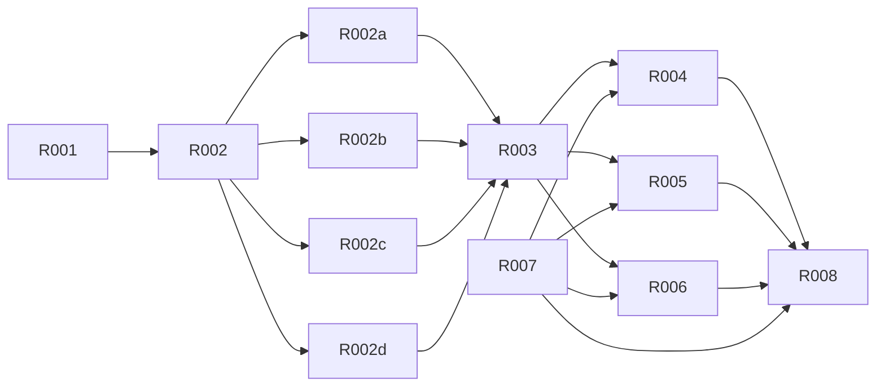

# Route migration plans

The current plan series is R001–R009 in this directory. Requirements are defined
in [../REQUIREMENTS.md](../../REQUIREMENTS.md); this index defines execution
order and status only. The former P001–P012 documents are retained as historical
planning records and are not completion evidence or current policy where they
conflict with the requirements.

## Dependency graph

| Plan                                            | Scope                                                   | Dependencies | Status           |
| ----------------------------------------------- | ------------------------------------------------------- | ------------ | ---------------- |
| [R001](R001-requirements-and-structure.md)      | Requirements, directory architecture, project gates     | none         | done             |
| [R002](R002-api-foundation.md)                  | Independent HTTP/API foundation                         | R001         | done             |
| [R002a](R002a-api-identity.md)                  | Auth, user, member, team                                | R002         | done             |
| [R002b](R002b-api-comic.md)                     | Comic, chapter, page, assignment, workset               | R002         | done             |
| [R002c](R002c-api-translator.md)                | Unit, search/transform, term and termbase               | R002         | done             |
| [R002d](R002d-api-message.md)                   | Mail, announcement, comment, invitation                 | R002         | done             |
| [R003](R003-session-and-assembly.md)            | Session, application assembly, ready auth/team          | R002a–d      | done             |
| [R004](R004-comic-controller.md)                | Comic detail, workspace/playground controllers, uploads | R003, R007   | done             |
| [R005](R005-leaf-routes.md)                     | Login/registration, mail, member, setting routes        | R003, R007   | done             |
| [R006](R006-translator-and-utility.md)          | Translator and utility workflows                        | R003, R007   | done             |
| [R007](R007-shared-interface-and-appearance.md) | Shared interfaces and light-only appearance             | R001         | done             |
| [R008](R008-acceptance.md)                      | Integrated acceptance and delivery                      | R004–R007    | locally verified |
| [R009](R009-restore-original-appearance.md)     | Restore original UI without redesign                    | R007         | in progress      |

## Execution ledger

R001–R007 have implementation records; they do not establish current acceptance.
R008 passed the complete local check on 2026-09-29. The user requested preserving
the original palette and registering its contrast debt separately; that snapshot
retained exact registered entries while rejecting new or changed violations.
See the [original contrast register](../review/original-contrast-register.md).
R009 tracks appearance corrections without redesigning the original palette.
Current evidence: [review corrections](../review/review-finding-correction.md)
and [appearance restoration](../review/appearance-restoration.md).

On 2026-10-04 the user approved a separate contrast correction. Its strict
[contrast gate](../../../README.md#配色与对比度) replaces the historical debt
register without establishing completion of any outstanding migration plan.

Earlier snapshot: [implementation results](../review/implementation-results.md).
